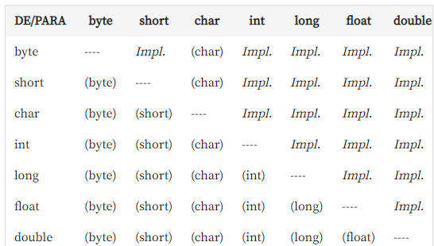

# Java

Hello world! 

Este repositório contém meus primeiros exercícios feitos com a plataforma Java. Aqui, no README, apenas algumas observações e anotações. 

Os códigos mesmo estão nas pastas. Let's code!


## Sumário

- [Como configurar o ambiente](#Como-configurar-o-ambiente)
- [Como executar um programa Java no prompt de comando](#Como-executar-um-programa-Java-no-prompt-de-comando)
- [Tipos Primitivos](#Tipos-Primitivos)
  - [Hierarquia de Tipos Primitivos e Casting](#Hierarquia-de-Tipos-Primitivos-e-Casting)

- 
## Como configurar o ambiente:

Faça os seguintes downloads e execute:
- JDK;
- Eclipse;
- Spring Boot;

Observação: Não esqueça de inserir a pasta bin do JDK na lista de "PATH" do seu computador. E por que? Sempre que você pedir que uma compilação seja feita, seu computador precisa saber qual o caminho (path) do compilador, que está justamente na pasta bin da pasta JDK. 

Para fazer a inclusão, pesquise na barra de buscas do seu computador "variáveis de ambiente", clique em Path e adicione um novo, colando o endereço da pasta jdk/bin (copia o endereço direitinho de acordo com a pasta onde você instalou seu JDK, hein?).


## Como executar um programa Java no prompt de comando

É preciso, antes de qualquer coisa, ter o Java instalado. Depois disto:

1. Digita o código em qualquer editor simples e salva com a seguinte regra `<NomeDaClasse>.java`;
2. Abre o prompt (na pasta em que o arquivo está);
3. Digita `javac <NomeDaClasse>.java` (para que o código seja compilado);
4. Digita `java <NomeDaClasse>` e o resultado aparecerá no prompt.

## Tipos Primitivos

### Hierarquia de Tipos Primitivos e Casting

Alguns tipos primitivos que envolvem números precisam de menos espaço que aqueles que estamos destinando a eles. Um exemplo disso é o número `int`, que não apresenta nenhum problema quando tentamos guardá-lo no número tipo `double`:

```java
double dinnerCost = 30;
System.out.println(dinnerCost);
    // 30.0 -> funciona perfeitamente
    
```

A "conversão" de int para double é feita de forma **implícita**.

Já no caso abaixo, teremos um erro...

```java
int payment = 840.5;
System.out.println(payment);
	// COMPILATION ERROR 
```

...porque, para que a conversão funcione, o operador precisa avisar ao Java de maneira **explícita**. A tabela abaixo traz os casos em que precisamos avisar.



double -> int? Adicione `(int)` explicitamente. E o nome disso é **Type Casting**.

